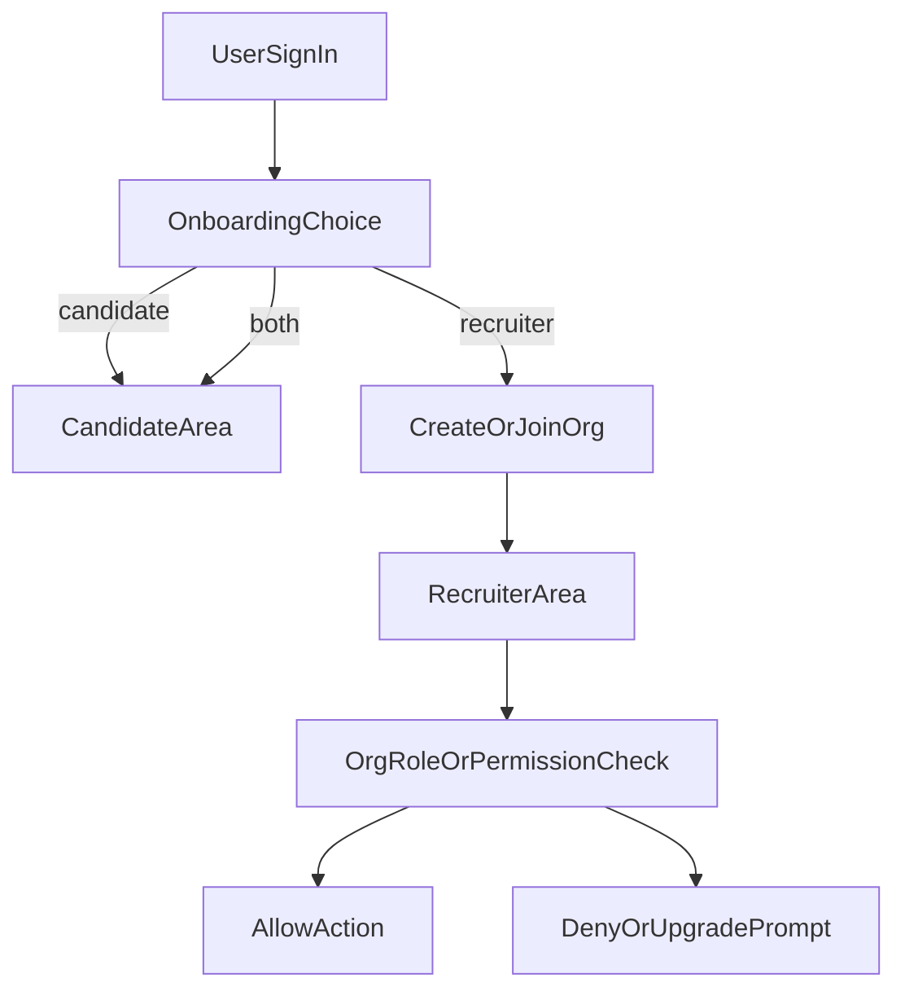

# Org-First Auth Rewrite Plan

## Goal

Replace the current global-role recruiter auth with a production-ready Clerk Organizations RBAC model, while keeping a single-login UX and clean candidate flow.

## Architecture Decisions

- Recruiter authorization source of truth: Clerk org roles/permissions (`has({ role | permission })`).
- Candidate access source of truth: signed-in user + candidate persona.
- `publicMetadata` usage: persona/routing hint only (`candidate | recruiter | both`), not recruiter authz.
- Billing readiness: enforce entitlement checks at `orgId` boundary.

## Target Flow

## Implementation Phases

### Phase 1: Auth Contract + RBAC Matrix

- Create spec doc defining:
  - route-level requirements (`/candidate/*`, `/recruiter/*`, `/api/*`)
  - org roles/permissions per recruiter capability
  - persona behavior and fallback redirects.
- Primary files:
  - `proxy.ts`
  - `lib/auth/access.ts`
  - `lib/auth/clerk-role.ts`

### Phase 2: Convex Data Model Rewrite (No Legacy)

- Add `orgId` to all recruiter-owned entities and indexes.
- Keep candidate-owned entities user-scoped.
- Remove assumptions of global recruiter scope in queries/mutations.
- Primary file:
  - `convex/schema.ts`

### Phase 3: Guard Rewrite (Middleware + Server + Convex)

- Middleware:
  - enforce recruiter routes require active org context.
  - enforce candidate routes independent of org context.
- Server/page guards:
  - central helpers for `requireOrgPermission(...)` and candidate access.
- Convex guards:
  - all recruiter/admin operations must verify org-scoped permissions.
- Primary files:
  - `proxy.ts`
  - `lib/auth/access.ts`
  - `convex/helpers/auth.ts`
  - recruiter/admin Convex modules under `convex/`

### Phase 4: Onboarding UX Rewrite

- Replace passive onboarding with active path:
  - candidate continue
  - recruiter create/join organization
  - both context support.
- Add recruiter org setup and org switcher entrypoint.
- Primary files:
  - `app/(app)/onboarding/page.tsx`
  - recruiter shell/layout routes under `app/`

### Phase 5: Clerk Webhooks + Projection Sync

- Expand webhook handling from user-only to org and membership lifecycle.
- Sync minimal projection in Convex for app queries, keeping Clerk as authority.
- Primary files:
  - `app/api/webhooks/clerk/route.ts`
  - `convex/users.ts`
  - new org membership sync module(s) in `convex/`

### Phase 6: Billing-Ready Gate Point

- Add org entitlement gate helper used by recruiter premium actions.
- Keep candidate flow unaffected.
- Primary files:
  - auth/billing guard helper in `lib/auth/`
  - recruiter APIs/routes using entitlement checks

### Phase 7: Verification and Cutover

- Validate:
  - candidate-only, recruiter-only, both personas
  - no-org, single-org, multi-org recruiter users
  - permission denials and cross-org isolation
- Update verification docs/checklists and close tracker items.
- Primary docs:
  - `.docs/verification-pending.md`
  - `.plans/hardening-and-polish-v1.md`

## Scope Boundaries

- No legacy compatibility layer.
- No dual-path old/new auth.
- Full rewrite toward org-first recruiter model.
- Candidate UX continuity remains mandatory.

## Acceptance Criteria

- Recruiter features are inaccessible without valid org context + permission.
- Candidate features work without org membership.
- One login supports both contexts cleanly.
- Org-level gate exists for future payments.
- All auth checks are consistent across middleware, server, and Convex APIs.
