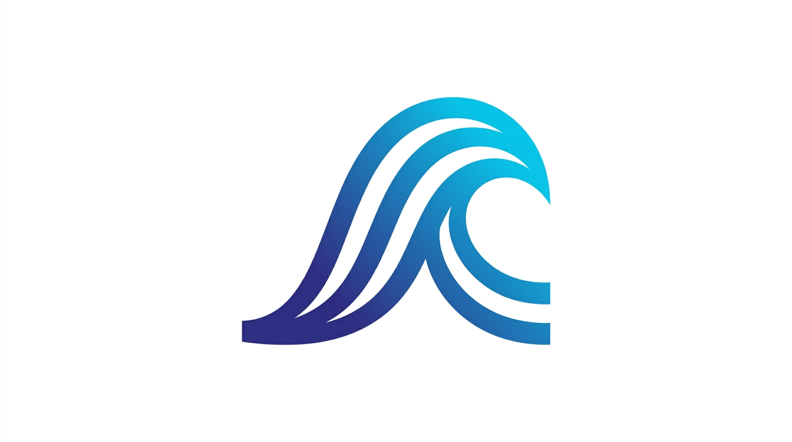
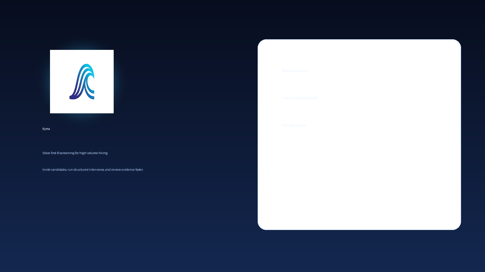
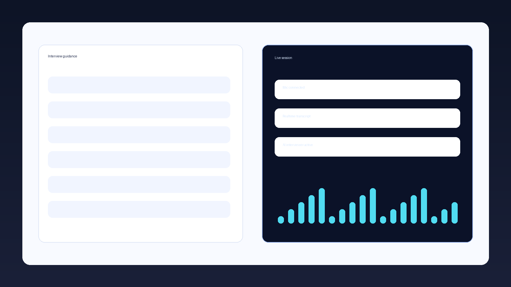
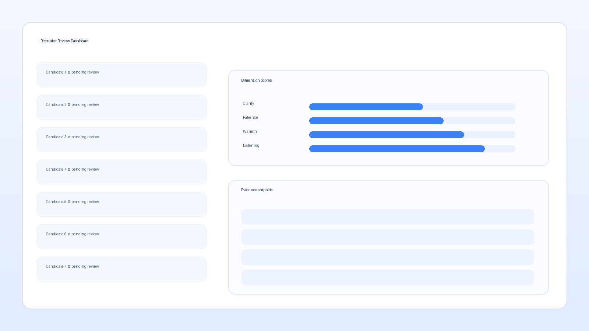

# Kyma

<p align="center">
  
</p>

<p align="center">
  <a href="https://kyma.kitsunelabs.xyz"></a>
  
  
  
</p>

Kyma is a **voice-first screening platform** for tutor and communication-heavy roles.

You send a candidate a link, they join a short guided interview in-browser, and your team gets a structured review with transcript, evidence, and decision support.

**Website:** [https://kyma.kitsunelabs.xyz](https://kyma.kitsunelabs.xyz)

## Why teams use Kyma

- **Faster first-pass screening** without sacrificing quality
- **Consistent evaluation** across every candidate
- **Evidence-based review** with transcript-backed signals
- **Human-in-the-loop decisions** instead of blind auto-rejects

## Product capabilities

- **Invite-driven candidate flow** with realtime interview sessions
- **Admin review workspace** for sessions, notes, and outcomes
- **Report copilot** grounded in saved evidence and transcript context
- **Policy controls** for duration, resume behavior, and attempts

## Product preview





## Demo and access

- Public site: [https://kyma.kitsunelabs.xyz](https://kyma.kitsunelabs.xyz)
- Local test route: `/interviews/demo-invite`
- In production, `demo-invite` is disabled by default unless `KYMA_ENABLE_DEMO_INVITE=1`.

### Product walkthrough media

- Demo video: *coming soon*
- Screenshots: available in `public/readme-hero.png`, `public/readme-candidate.png`, and `public/readme-recruiter.png`

### Icon and brand assets

- Primary mark: `public/kyma-mark.png`
- Favicon set: `public/favicon.ico`, `public/favicon-16x16.png`, `public/favicon-32x32.png`, `public/favicon-48x48.png`
- Touch/app icons: `public/apple-touch-icon.png`, `public/android-chrome-192x192.png`, `public/android-chrome-512x512.png`
- Social preview: `public/og-image.png`

If you want public trial access, the clean approach is:

- create a dedicated **demo workspace** in production
- generate invite links for that workspace
- optionally create a low-privilege recruiter demo account (never hard-code credentials in this repo)

## Self-hosting

Kyma can be self-hosted for teams that want infrastructure control.

### Requirements

- Bun runtime
- Convex project/deployment
- LiveKit server credentials
- Optional Clerk (admin auth)

### Quick start

```bash
bun install
bun run convex:once
bun run dev
```

For active backend/schema work:

```bash
bun run convex:dev
```

To run the interviewer worker:

```bash
bun run agent:dev
```

### Environment variables

Set these in `.env.local`:

- `NEXT_PUBLIC_CONVEX_URL`
- `NEXT_PUBLIC_LIVEKIT_URL`
- `LIVEKIT_API_KEY`
- `LIVEKIT_API_SECRET`

Optional/advanced:

- `KYMA_ENABLE_DEMO_INVITE` (`1` to allow `demo-invite` in production)
- `LIVEKIT_AGENT_NAME`
- `LIVEKIT_AGENT_STT_MODEL`
- `LIVEKIT_AGENT_LLM_MODEL`
- `LIVEKIT_AGENT_TTS_MODEL`
- `KYMA_REVIEW_CHAT_MODEL` (enables model-backed recruiter chat)

For Clerk-backed admin:

- `NEXT_PUBLIC_CLERK_PUBLISHABLE_KEY`
- `CLERK_SECRET_KEY`
- `CLERK_FRONTEND_API_URL` or `CLERK_JWT_ISSUER_DOMAIN`

## BYOK and model routing status

Current state (honest):

- **Live interview agent model selection:** works via environment variables (`LIVEKIT_AGENT_*_MODEL`).
- **Recruiter report chat model selection:** works via `KYMA_REVIEW_CHAT_MODEL`.
- **True BYOK (per-workspace encrypted customer keys):** **not fully implemented yet**; boundaries are scaffolded and documented, but not production-complete.

See `TODO.md` for implementation priorities.

## Docs

- Product/business write-up: [WRITE_UP.md](WRITE_UP.md)
- Contribution guide: [CONTRIBUTING.md](CONTRIBUTING.md)
- License: [LICENSE](LICENSE)
- Engineering priorities: [TODO.md](TODO.md)

## Contributing

PRs are welcome. Please read [CONTRIBUTING.md](CONTRIBUTING.md) for workflow and quality checks.